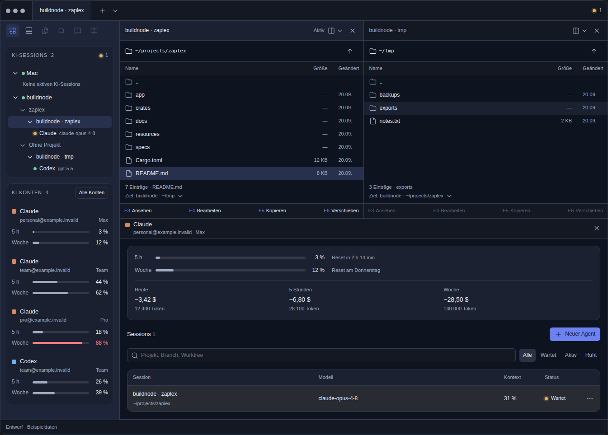
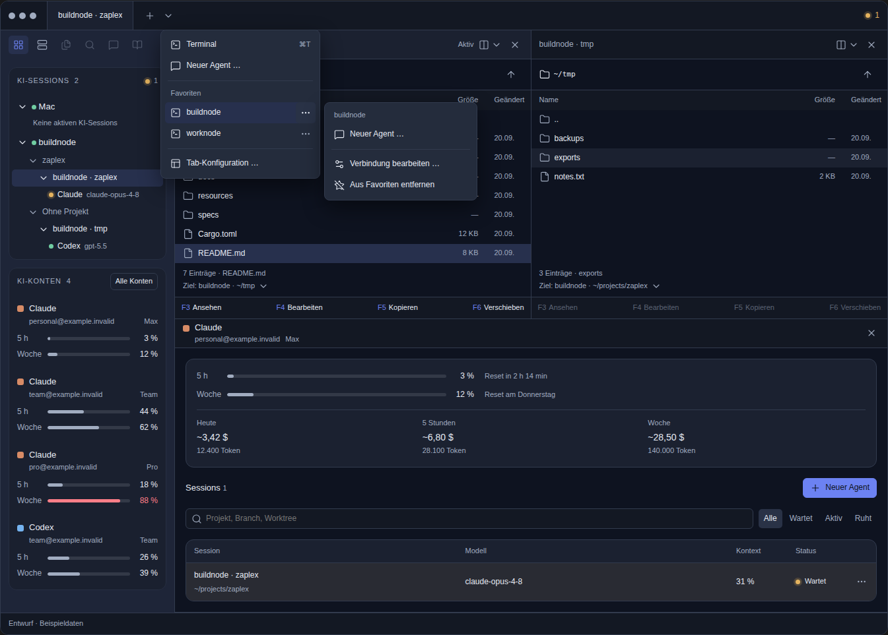

# UI-Referenz für die Premium-Workspace-Abnahme

## Verbindlicher Einstieg

- [Spezifikation mit Referenzansichten](cockpit-sidebar-connections.html): Regeln im Abschnitt `#spec`.
- [Interaktiver Mockup in voller Breite](premium-workspace.html): derselbe Entwurf für Desktop und schmale Breiten.
- [PRODUCT](../../specs/GH-160/PRODUCT.md) und [TECH](../../specs/GH-160/TECH.md): Verhalten und native Umsetzung.
- [#459](https://github.com/byte5ai/zaplex/issues/459): Koordination und Abnahme; [PR #465](https://github.com/byte5ai/zaplex/pull/465): bereits integrierte Implementierung.

Die HTML-Dateien nach dem Checkout direkt im Browser öffnen. GitHub zeigt HTML als Quelltext,
nicht als laufenden Mockup. Es ist kein Zaplex-Build erforderlich. Der Standalone-Export enthält
den Entwurf und seine Browser-Laufzeit; für die versionsgebundenen Icon-/Tooltip-Bibliotheken
wird Netzwerkzugriff auf `unpkg.com` benötigt. Es gibt keine Verbindung zu Produktivhosts.

Direkt auf GitHub sichtbare Aufnahmen desselben Artefakts (keine separaten Designvarianten):

## Herkunft und Geltung

Referenz ist die letzte interaktive Designiteration vom **20.09.2026**, anonymisiert und am
**23.09.2026** versioniert. Übernommen wurden Layout und Interaktionen, nicht die verworfenen
Vorstufen. Ausgetauscht wurden ausschließlich personenbezogene Beispieldaten: Konten gegen
`example.invalid`, Hostnamen gegen `buildnode`, `worknode`, `testnode`, Benutzerpfade gegen
`/home/developer`, Sessionkennungen und ein privater Projektname gegen neutrale Fixtures.
Der Export ergänzt die Browser-Laufzeit und eine auf den Mockup begrenzte Reduced-Motion-Sicherung,
ohne neue Produktnavigation einzuführen.

Die frühere statische Darstellung in `cockpit-sidebar-connections.html` ist vollständig durch
Einbettungen dieses einen Artefakts ersetzt. Andere historische HTML-Dokumente sind keine
alternative Freigabe für den Umfang von #459. Spezifische Fixtures wie
[schmale Sessionzeilen](connections-session-rows.html) ergänzen die Referenz, ersetzen sie nicht.

Explizite Regeln in `#spec` sowie PRODUCT/TECH haben Vorrang vor Demo-Daten und nicht simulierten
Zuständen. Die Browser-Farbwerte illustrieren Theme-Rollen; sie dürfen nicht als hartcodierte
Produktfarben übernommen werden. Die Synchronisierung dokumentiert die Zielvorgabe für die
bereits vorhandene Implementierung. Sie erklärt diese **nicht** nachträglich für abgenommen.

## Konkreter Abgleich

| Bereich | Im Mockup prüfen | Nativ zusätzlich nachweisen |
|---|---|---|
| Sidebar | Cockpit/Verbindungen über die vorhandenen Icons; gleiche Hierarchie, abgesetzte durchgehende Fläche, kein zusätzlicher Shell-Sessions-Link | Hell/Dunkel/Kontrast, lange Identitäten, reale Mindestbreite |
| Konten | 5 h und Woche untereinander; Konto-Klick ergänzt/fokussiert Details, übrige Panes bleiben erhalten | Echte Kontenzuordnung, Zustände und Datenherkunft |
| Titel | Pane-Titel aus Host und Verzeichnis; Tabtitel folgt der fokussierten Pane, kein erfundener Gruppenname | Explizite Tabtitel, reale Verzeichniswechsel und Restore |
| Favoriten | Hostname verbindet direkt; separates `⋯` öffnet seitlich bei sichtbar bleibendem Elternmenü | Einmaliger Verbindungsaufbau, Tastatur, Randplatzierung und Fokusrückgabe |
| Mehrhost-Panes | Pane-Split nach rechts/unten, Zielhost/Lokal wählen; neuer Tab hat volle Höhe | Asynchrones Hostrouting, echte PTYs, Drag & Drop derselben Pane, Fensterwechsel, Neustart-Restore |
| Dateimanager | Modus pro Session; einzeilige F3–F6, nur fokussierte Pane aktiv; `..` markiert das verlassene Verzeichnis | Reale lokale/Remote-Dateien, eindeutige Transferziele und sichere Revalidierung |
| Reconnect | Recovery-Vorschau über die Entwurfsoptionen; Eingabe bis Bereitschaft gesperrt | Dieselbe Remote-Session/Generation, echter Shell-Ready-Nachweis, Timeout, Retry und Abbruch |

## Grenzen des Artefakts

- Shellausgaben, Kontoverbrauch, Dateien, Transfers und Reconnect sind ausschließlich simuliert.
- Drag & Drop bestehender Panes ist im Mockup **nicht implementiert**; #462 und native Abnahme bleiben maßgeblich.
- Agent-Start, Verbindungsbearbeitung und einige vorhandene Sidebar-Werkzeuge sind Vorschau/Platzhalter.
- Statusanimationen, reale Fehler-/Ladezustände und sämtliche Plattformdetails sind nicht vollständig simuliert.
- Browserprüfungen belegen nur die Funktionsfähigkeit dieser Referenz. Sie belegen weder native
  UI-Parität noch erfolgreiche echte Verbindungen oder die Abnahme von PR #465.

## Bereits belegte Abweichung der Implementierung

Im integrierten Stand von PR #465 enthält
[`app/src/cockpit/panel.rs`](../../app/src/cockpit/panel.rs) weiterhin den zusätzlichen Link
`cockpit-shell-sessions-connections` mit `WorkspaceAction::OpenSshManager`. Der Referenzentwurf
verwendet ausschließlich die vorhandene Sidebar-Navigation. Diese Dokumentationsänderung
entfernt den Link aus der Vorgabe, **nicht aus dem Produktcode**. Das bleibt als Abweichung für
#459/#160 offen; eine umfassende native Prüfung ist damit nicht durchgeführt.

Gefundene Abweichungen der bestehenden App in #459 beziehungsweise dem zuständigen Teilissue
mit Referenzzustand und nativer Evidenz dokumentieren. Nicht den Mockup stillschweigend an die
Implementierung anpassen und nicht ohne Auftrag erneut Produktcode umgestalten.
